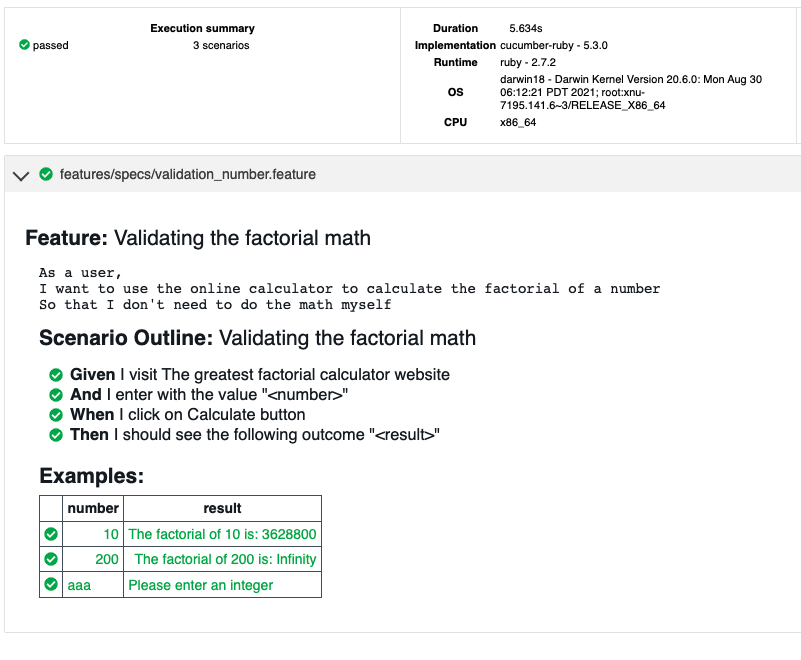

# Automation Test GFC
The purpose of this project is to automate the site [The greatest factorial calculator!](http://qainterview.pythonanywhere.com/) using the following frameworks describe below: 

-  [Capybara](https://github.com/teamcapybara/capybara)
-  [Cucumber](https://cucumber.io/)
-  [Ruby](https://www.ruby-lang.org/en/)
-  [Selenium](https://www.selenium.dev/)
-  [Bundler](https://bundler.io/)

## Getting Started
### Prerequisites

- [Ruby @2.7.2](https://www.ruby-lang.org/en/news/2020/10/02/ruby-2-7-2-released/)

## Installation
The steps below describe how to install all dependecy for macOS

```bash
brew install ruby@2.7.2
```

```bash
gem install bundler
```

```bash
bundle install
```

## Running the tests
After the installation and configuration of the environment, access the end in the path of the folder where the file was downloaded

```bash
cucumber
```

## Multi browser testing
The automation test is prepared to run in the following browsers (default: chrome):

- Chrome (chrome)
- Chrome headless (chrome_headless)
- Firefox (firefox)
- Firefox headless (firefox_headless)

```bash
cucumber -p <browser_name>
```

## Test report

For easier understanding of the result and better visibility of the tests, the script will generate a final report at the end of each execution.

Example of report:
